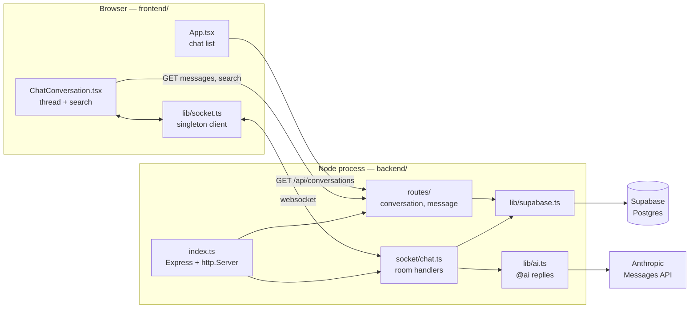
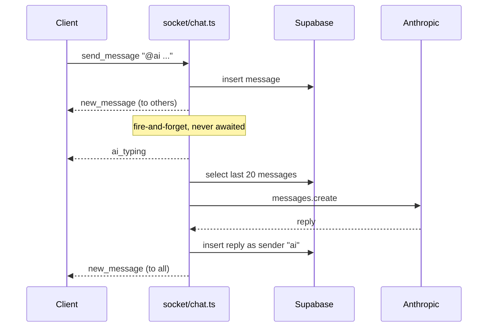

# System Architecture

QuickChat is a WhatsApp-style chat demo: a Vite/React SPA talking to one Express
process that owns both the REST API and the socket.io server, with Supabase as the
only datastore and Anthropic reached on one narrow path.

## Components

One process serves everything. In production `index.ts` also serves the built SPA
from `dist/public` (or `../frontend/dist`) and falls through to `index.html` for any
non-`/api`, non-`/socket.io` path, so frontend and backend share an origin.

## HTTP surface

| Route | Purpose |
|---|---|
| `GET /api/conversations` | Chat list, each row enriched in JS with its newest message |
| `GET /api/conversations/:id/messages` | Full thread, oldest first, unbounded |
| `GET /api/conversations/:id/messages/search` | Case-insensitive `ilike` substring match |
| `POST /api/conversations/:id/messages` | Non-socket message insert |
| `GET /health` | Liveness |

Reads and writes go through the Supabase JS client with the **service key**, so
PostgREST row-level security is bypassed entirely by design.

## Socket events

Client → server: `join_room`, `leave_room`, `send_message`, `user_typing`.
Server → client: `joined_room`, `new_message`, `user_typing`, `ai_typing`,
`ai_error`, `error`.

The room name **is** the conversation id. `send_message` broadcasts with
`socket.to(...)` — everyone *except* the sender, which already rendered its own
text optimistically. The AI reply broadcasts with `io.to(...)` instead, because the
sender did not render that one.

## The `@ai` path

Ordering is deliberate: the user's message is persisted and broadcast **before**
Anthropic is touched, so an outage there can never block or roll back ordinary
chat. The call is not awaited — it takes seconds and must not hold the send
handler. `replyAsAi` never throws; a failure logs server-side and emits `ai_error`,
and nothing is persisted for it.

Trigger is a strict `@ai` token (`lib/ai.ts`) — `email@ai.com` and `@aisle` do not
match. The AI is a sender like any other: `sender_id` is plain text with no foreign
key, so it needed no migration.

## Data model

Two tables (`backend/supabase/schema.sql`): `conversations` and `messages`, joined
by `messages.conversation_id` with `on delete cascade`. Indexes exist on
`conversation_id` and `created_at` separately. `unread_count` is **not** stored —
the conversation list hardcodes `0`.

## Auth and org boundaries

There are none. This is a single-tenant demo: the client identity is the constant
`demo-user` / `"You"` in `ChatConversation.tsx`, no socket middleware authenticates
a connection, and no route checks a caller. Every conversation is visible to
everyone. CORS is the only gate — `FRONTEND_URL` origins always, plus any localhost
origin outside production.

Adding real auth means adding an `io.use()` middleware and per-route checks at the
same time; neither exists to build on today.

## External dependencies

- **Supabase** — the datastore behind every conversation and message.
  Credentials: `SUPABASE_URL`, `SUPABASE_SERVICE_KEY`. `lib/supabase.ts` throws at
  import if either is missing, so the process fails fast rather than half-working.
- **Anthropic** (`@anthropic-ai/sdk`) — reached only from `lib/ai.ts`, only on an
  `@ai` mention. Credential: `ANTHROPIC_API_KEY`, read from the gitignored backend
  env file. The client is built lazily, so a missing key surfaces as a call failure
  the socket handler already catches, not a boot crash.
  Cost bounds: last 20 messages, `max_tokens` 1024, `effort: low`, one reply per
  triggering message. **No rate limit and no auth in front of it.**

## Operational concerns

- Errors are shaped in `lib/error.ts`: `{ error: { code, message }, requestId }`.
  Provider payloads are logged as JSON server-side and never returned to a client.
- A `PGRST*` code means the database answered and rejected us — a bug on our side,
  returned as 500. No code means we never reached it (DNS, TLS, refused) — 503,
  the only case worth retrying.
- The client reconnects up to 5 times (`lib/socket.ts`) and shows a
  "Reconnecting…" banner while down. Missed messages during a drop are **not**
  backfilled on reconnect.

## Update triggers

Update this file when API routes, socket events, auth or org boundaries, or major
component ownership change.

## Change Log

- 2026-09-15 — Replaced the section template with the actual system: components,
  routes, socket events, the `@ai` sequence, data model, and the explicit note
  that no authentication exists.
- 2026-08-31 — Added Anthropic as an external dependency on the socket
  `send_message` path (`@ai` mention replies). New server→client socket events
  `ai_typing` and `ai_error`; no new HTTP route and no schema change.
